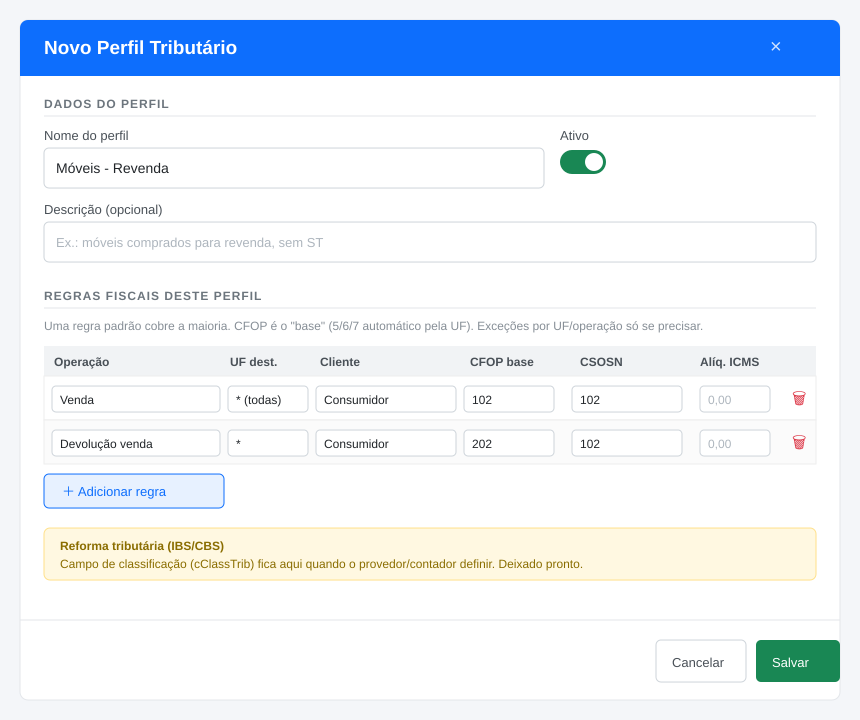
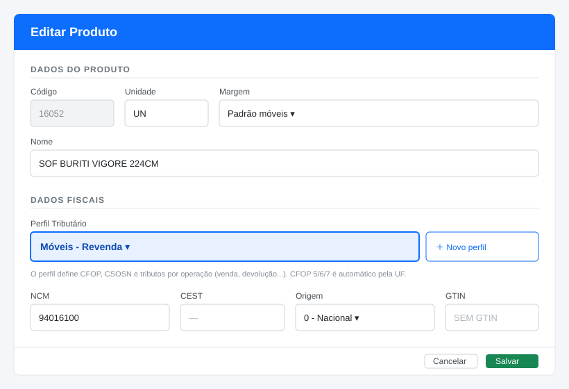
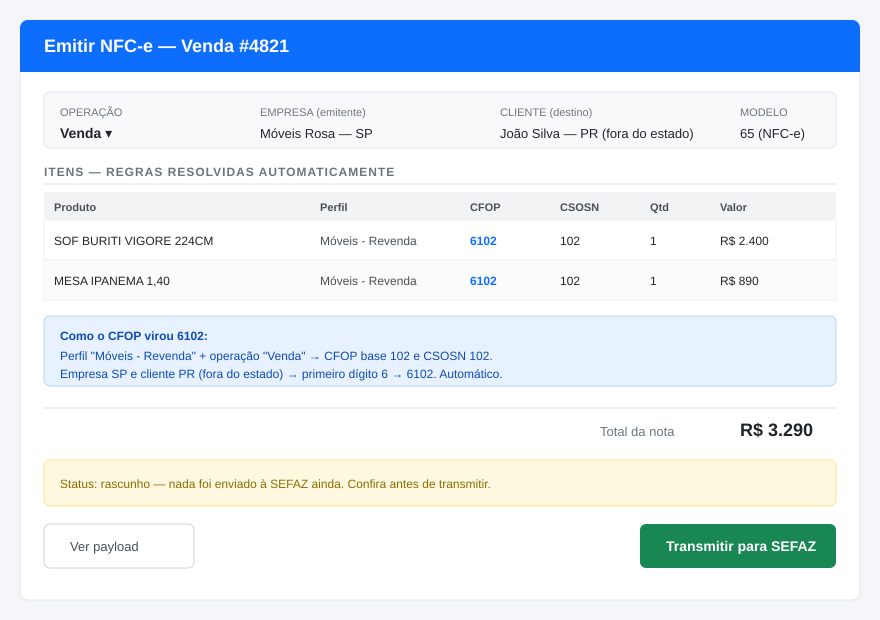
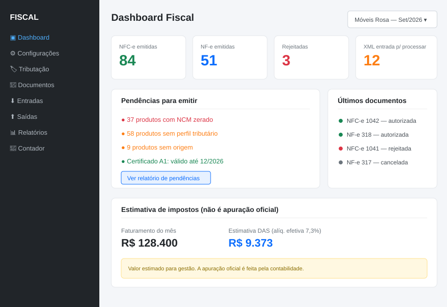
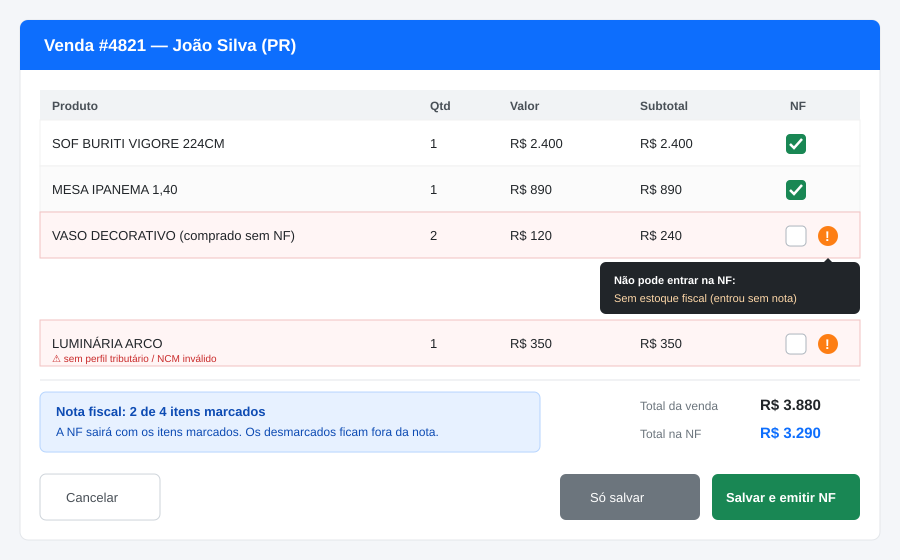
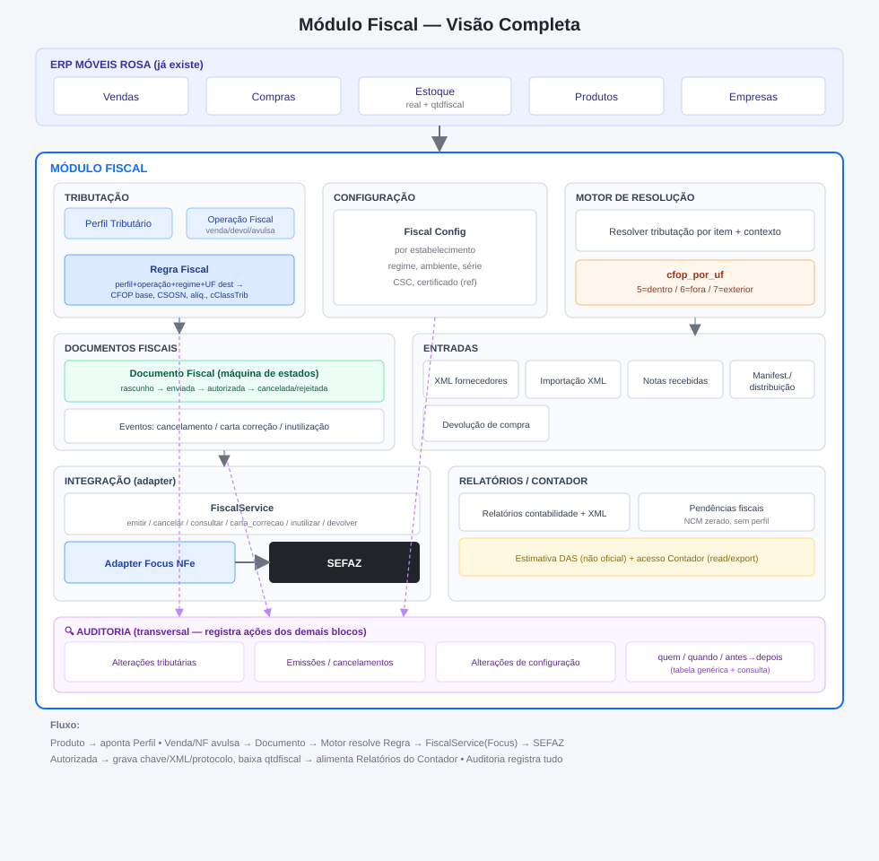

# Módulo Fiscal — Design e Decisões

> Contexto salvo do estudo de arquitetura do módulo fiscal. Referencie com #modulo-fiscal quando voltar ao tema.
> ERP Rails (Móveis Rosa). Simples Nacional. Emite NF-e (55) e NFC-e (65). Provedor: **Brasil NFe (plano Solo)** — escolhido por emissão ilimitada 55/65 + devoluções; adapter isola a escolha (reversível). Visão multiempresa + preparação reforma tributária (IBS/CBS).

## Princípios

1. Produto NÃO guarda tributação; aponta para um **Perfil Tributário** (`perfil_tributario_id`). Muitos produtos → mesmo perfil.
2. Tributação real é resolvida por **contexto** (regime + UF destino + operação + tipo cliente), não campo fixo.
3. Multiempresa desde o modelo: toda tabela fiscal com `cod_empresa`; certificado/série/CSC por estabelecimento.
4. Provedor atrás de um **adapter** (`FiscalService`); provedor é detalhe substituível (Focus NFe OU Brasil NFe — não decidido).
5. Documento fiscal é **máquina de estados** (rascunho→enviada→autorizada→cancelada/rejeitada) com XML/chave/protocolo persistidos + eventos.
6. Espaço para **IBS/CBS** (cClassTrib) desde já, mesmo vazio.

## Entidades

- **perfil_tributario**: cadastro reutilizável (nome, descrição, ativo). Não contém CSOSN/CFOP.
- **operacao_fiscal**: tipo de movimento (venda, devolução venda, devolução compra, transferência...). Natureza + modelo 55/65.
- **regra_fiscal** (coração): `(empresa/regime + perfil + operacao + uf_destino + tipo_cliente) → CFOP base, CSOSN/CST, alíquotas, PIS/COFINS, cClassTrib`. `uf_destino` aceita curinga `*` e é usado só para EXCEÇÕES tributárias (alíquota/CST que muda por UF), não para CFOP.

### CFOP automático (decisão confirmada)
- A regra guarda o **CFOP base** (3 dígitos, ex: `102`), NÃO o CFOP completo.
- O primeiro dígito é resolvido na emissão comparando UF da empresa x UF do cliente:
  - mesma UF → `5` + base (ex: 5102)
  - UF diferente → `6` + base (ex: 6102)
  - exterior → `7` + base
- Helper puro: `cfop_por_uf(base, uf_empresa, uf_cliente)`.
- Isso elimina a necessidade de uma regra por UF só para variar CFOP; "uf_destino" fica só para exceções tributárias reais (raro no Simples).

### Demais entidades
- **fiscal_config**: por estabelecimento — regime, ambiente (homolog/prod), série+numeração NF-e/NFC-e, CSC/token NFC-e, referência ao certificado (nunca o .pfx no repo).
- **documento_fiscal**: status, chave 44díg, protocolo, número, série, xml_ref, origem (cod_venda/cod_compra).
- **documento_fiscal_evento**: cancelamento, carta de correção, manifestação (cada um com xml/protocolo).

## Decisão de UX (confirmada pelo usuário)
- Perfil e Regras são tabelas separadas no banco, mas **cadastradas na mesma tela** (perfil no topo, regras em tabela editável embaixo) — "como se fosse um só".
- **O produto vincula o PERFIL TRIBUTÁRIO** (um select), não a operação nem a regra. CSOSN/CFOP saem do cadastro do produto (viram legado). No produto ficam só: NCM, CEST, origem, GTIN e perfil_tributario_id.
- Botão "＋ Novo perfil" ao lado do select no produto, para criar sem sair da tela.

## Fluxo de emissão (confirmado)
Para cada item da venda:
1. Operação = definida pela ação (Venda / Devolução / ...).
2. Item → Produto → Perfil.
3. Dentro do perfil, seleciona a **regra que casa com a operação**.
4. Regra entrega CFOP base + CSOSN/CST + alíquotas + cClassTrib.
5. `cfop_por_uf` resolve o dígito (5 mesma UF / 6 outra UF / 7 exterior) comparando UF empresa x UF cliente.
6. Monta item; repete; monta payload; FiscalService(Focus) transmite.
Documento nasce em status "rascunho" (confere antes de transmitir).

## Emissão a partir da venda — verificação por item (decisão de UX)
- Nem todo produto pode entrar na NF (ex: mercadoria comprada sem nota / "vendedor de rua" → sem estoque fiscal).
- Na tela da venda, cada linha de item tem uma coluna **"NF" com checkbox**:
  - Item ok → checkbox marcado (entra na nota).
  - Item com problema → checkbox desmarcado automaticamente + ícone ⚠ com tooltip do motivo.
- Verificações por item (via AJAX ao adicionar o item): estoque fiscal (`qtdfiscal`), perfil tributário definido, NCM válido (≠ 00000000), origem preenchida, CFOP/CSOSN resolvíveis.
- Botões: "Só salvar" e "Salvar e emitir NF" (emite só os itens marcados). Resumo mostra total da venda x total na NF.
- Usuário pode remarcar manualmente (forçar), MAS: dar saída fiscal sem estoque fiscal é decisão do contador (risco fiscal). `qtdfiscal` existe justamente para esse controle. Confirmar com contabilidade a política de forçar.
- Mock: docs/fiscal/05-venda-nf-por-item.svg

## Emissão diferida (venda agora, nota depois) — decisão aprovada
- Venda e emissão de NF são momentos separados. Venda tem **status fiscal**: sem_nota / nota_pendente / nota_emitida.
- Cenário real: produto ainda vai chegar; cliente pode querer a nota na hora ou depois. Se ainda não há estoque fiscal, o item aparece desmarcado com ⚠ "aguardando entrada"; quando a mercadoria entra, emite.
- Lista/dashboard: filtro "vendas com NF pendente".

## Devolução de compra (Fatia 4) — fluxo definido pelo usuário
- Frequência: ~2/mês. Abordagem escolhida: **espelhar o XML da nota de compra original** (Opção 1).
- Fluxo: acha a NF de compra importada → "Devolver" → carrega itens do XML → marca total OU desmarca/exclui itens (parcial) → ajusta quantidade → sistema recalcula impostos destacados proporcionalmente (ICMS/ST/IPI/valores) → gera ESPELHO para conferência → confirma → emite NF de devolução referenciando a chave da NF original.
- Base já existe: itemcompra guarda icms, ipi, valorst, valorunitario, quantidade, valor_frete. XML importado disponível.
- Atenção no recálculo parcial: arredondamento de centavos e rateio de desconto/frete.
- Melhoria futura: guardar chave_acesso da NF de compra (hoje pode ler do XML na hora).

## NF avulsa (sem venda vinculada) — aprovada, com ressalva de estoque fiscal
- Emissão de NF independente, não nasce de uma venda do sistema. Casos: cliente quer nota depois, complemento fiscal, situações fora do fluxo de venda.
- **Afeta só o estoque fiscal (`qtdfiscal`), NÃO o estoque real** — o produto físico já saiu / não passa pelo estoque real.
- Modelada como uma **operação** ("NF avulsa") gerando documento_fiscal; baixa só qtdfiscal.
- Alternativa mais limpa que "trocar por similar": emite a nota do produto que realmente se quer notar.
- Ressalva: só deveria emitir de produto com `qtdfiscal` disponível. Emitir de produto sem estoque fiscal deixa qtdfiscal negativo (mesmo risco fiscal). Impedir vs. só avisar = política do contador.
- Garantia: usuário informou que ele mesmo presta garantia, então esse aspecto não é bloqueio no caso dele.

## Entradas (documentos recebidos)
- XML de fornecedores; Importação XML (manual); Notas recebidas (NF-e contra o CNPJ); Manifestação / distribuição; Devolução de compra.
- "Compras" e "Eventos" NÃO entram aqui: Compras é módulo do ERP; Eventos pertencem a Documentos Fiscais. Evita duplicação conceitual.

## Auditoria (camada transversal) — aprovada
- Não é um silo; observa os demais blocos e registra ações sensíveis: alterações tributárias (perfil/regra), emissões/cancelamentos, alterações de configuração (certificado, série, ambiente).
- Registro: quem / quando / antes→depois / tipo de evento.
- Manter simples: uma tabela genérica de auditoria + tela de consulta com filtros (sem versionamento complexo). Pode ser a tabela polimórfica que unifica produto_fiscal_logs + auditoria fiscal no futuro.
- Já existe base: produto_fiscal_logs é uma trilha de auditoria de mudança fiscal do produto.
- Entra no roadmap junto do acesso do contador (Fatia 5) — não auditar o que ainda não existe.

## UF de origem — vem da empresa emitente
- A UF de origem NÃO é campo da regra: sai do cadastro da empresa (endereço→cidade→estado). A empresa já está na chave da regra. Evita redundância/inconsistência.
- UF destino: só na regra como filtro de EXCEÇÃO tributária; para CFOP é resolvido por cfop_por_uf comparando origem(empresa) x destino(cliente).

## Matriz e filial
- Fiscalmente são ESTABELECIMENTOS distintos: mesmo CNPJ raiz (8 díg.), CNPJ completo diferente (sufixo 0001/0002...), IE própria, endereço/UF próprio, e **numeração/série de NF independentes**. A NF sai com CNPJ/IE/endereço do estabelecimento que vendeu.
- Banco atual já é multiempresa real: `empresa` tem cpf_cnpj, inscricaoestadual, endereco, cod_cidade(→UF); venda/compra/estoque/empresaproduto têm cod_empresa. Então matriz e filial = dois registros em `empresa` (dois cod_empresa).
- Design já cobre o essencial: `fiscal_config` por cod_empresa → série/numeração/CSC/certificado por estabelecimento (evita conflito de numeração que a SEFAZ rejeita).
- NÃO precisa estrutura nova agora.
- Direção futura preferida do usuário: tabela **`grupo`** + `empresa.cod_grupo` (mais flexível que auto-referência matriz/filial). Cobre tanto matriz+filiais (mesma raiz CNPJ) quanto grupo econômico (empresas com CNPJs de raízes diferentes, mesmo dono).
- IMPORTANTE: grupo é camada de ORGANIZAÇÃO/GESTÃO (relatórios consolidados, permissões, filtros), NÃO de emissão. Emissão continua SEMPRE por estabelecimento (cod_empresa): cada empresa emite com seu CNPJ/IE/série. O fiscal não deve amarrar nada ao grupo.
- Encaixe: filtro por grupo em Relatórios/Contador e Auditoria. Aditivo (1 tabela + FK opcional), sem refazer o fiscal. Transferência entre empresas do grupo = operação fiscal por par de empresas, não pelo grupo.

## NÃO usar "transações" do painel do provedor (decisão)
- O Brasil NFe (como o MyRP) permite cadastrar transações/tributação no painel deles. NÃO usar.
- Motivo: (1) amarra ao provedor — trocar de provedor perderia a config; (2) duas fontes de verdade (painel vs Perfil do sistema) = divergência; (3) ERP ficaria sem saber a tributação (perde autonomia/relatórios).
- Decisão: a fonte da tributação é o PERFIL TRIBUTÁRIO do nosso sistema; o adapter monta o Imposto (ICMS/CSOSN, CFOP...) no payload e manda pronto. Provedor só transmite. Terceiriza-se infra (certificado, comunicação SEFAZ), não a regra fiscal do negócio.

## PENDENTE — Ajustes no relatório de Pendências Fiscais (empresa piloto = 2)
Investigado (context-gatherer). Modelo real:
- Estoque é por **produto+cor+empresa** (empresaproduto: cod_empresa+cod_produto+cod_cor; varias linhas por produto, uma por cor). Estoque real via function_estoquereal / empresaproduto.quantidade.
- Dados fiscais (ncm, origem, csosn, perfil) ficam NO PRODUTO (nao variam por cor) -> pendencia fiscal por produto esta CORRETA. (empresaproduto.cest existe mas parece legado/nao usado — confirmar).
- Itemvenda referencia produto E cor (cod_cor) -> a linha da NF sai de um empresaproduto (produto+cor).
- Padrao do sistema p/ "vendavel": produto.ativo + empresaproduto.ativo + cores.ativo, sempre por cod_empresa (ver vendas_controller/compras_controller).

Ajustes a fazer no fiscal_pendencias_controller (hoje usa current_collaborator.cod_empresa e so quantidade>0):
1. **Seletor de empresa** (padrao empresa 2 = piloto), nao fixar na empresa do usuario logado.
2. Alinhar filtro de estoque ao padrao: exigir empresaproduto.ativo=true E cores.ativo=true E quantidade>0.
3. Manter deteccao de pendencia por produto; opcional: mostrar impacto por produto+cor.

## Adapter do provedor
`FiscalService`: emitir / consultar / cancelar / carta_correcao / inutilizar / devolver. Impl possíveis: FocusAdapter e/ou BrasilNfeAdapter.
PROVEDOR ESCOLHIDO: **Brasil NFe (plano Solo)**. Motivo: Solo tem emissão ILIMITADA de 55 e 65 + devoluções e demais operações no próprio plano. Focus (plano Retail/NFCe) tinha volume suficiente mas aparentemente sem devolução no plano — e devolução é usada. Decisão reversível: FiscalService/adapter isola; trocar de provedor = trocar adapter.
Confirmado na página oficial (brasilnfe.com.br/products/nf-e): emissão 55 com cancelamento, inutilização, carta de correção e DANFE via JSON. Devolução = emissão de NF-e normal com CFOP de devolução (1202/2202) referenciando a chave da nota original — não precisa endpoint dedicado; coberto pela emissão 55.
A confirmar antes de pagar: validar na doc técnica/homologação o payload de devolução (CFOP + ref da nota) e inutilização; ou perguntar ao suporte (anunciam 24/7) se está no plano Solo. Parte B: implementar BrasilNfeAdapter.

## Aproveitar do que já existe
- produto.ncm/cest/origem/gtin ficam no produto; **produto.csosn vira LEGADO/fallback** (substituído por perfil_tributario_id na migração suave).
- produto_fiscal_logs: trilha de mudança fiscal do produto.
- xml_storage / importação XML: reaproveitar para XML autorizado e entradas.
- estado (sigla+IBGE): UF destino nas regras.
- access_role_permission: papel "Contador" (read+export; edita classificação com auditoria; não edita documento emitido).
- venda/itemvenda, compra/itemcompra: origem dos documentos.

## Migração suave (sem big bang)
1. Introduzir perfil/operacao/regra sem remover csosn do produto (fallback).
2. Produto aponta perfil; sem perfil, usa campo legado.
3. Regras cobrindo tudo → legado deixa de ser usado.

## Roadmap em fatias
1. Perfil + Operação + Regra; vincular no produto/compra. (não emite)
2. Parte A (neutra): Fiscal Config + interface FiscalService. Parte B: adapter(s) em homologação (testar Focus e/ou Brasil NFe); 1 NFC-e teste em cada para decidir.
3. Emissão real NFC-e (balcão) + status/eventos + XML.
4. NF-e (55), devoluções, carta de correção, cancelamento.
5. Acesso contador + relatórios para contabilidade + **auditoria** (consulta de trilha).

## Pendências / riscos
- **Certificado .pfx exposto no Git** (working tree em public/assets + histórico). Ações: (a) revogar/reemitir com contador — tratar como comprometido; (b) `.gitignore` + `git rm --cached`; (c) limpar histórico (filter-repo/BFG, destrutivo, push --force). `.gitignore` não ignorava .pfx.
- Transações `idle in transaction` (cliente Hibernate externo) travam ALTER TABLE. Migrations fiscais grandes: janela + lock_timeout + disable_ddl_transaction!. Resolver raiz: idle_in_transaction_session_timeout no Postgres.
- Começar regras simples (padrão por perfil + poucas exceções). Não modelar todo ICMS-ST de uma vez.
- IBS/CBS: acompanhar com contador + Focus o que/quando preencher.

## Mockups das telas (estudo)

Imagens salvas em `docs/fiscal/`. São rascunhos de UI para discussão, não telas finais.

### 1. Cadastro de Perfil Tributário (perfil + regras na mesma tela)

### 2. Produto vinculado ao Perfil (o produto só aponta o perfil)

### 3. Emissão de NFC-e (regras resolvidas automaticamente, CFOP 5/6/7 pela UF)

### 4. Dashboard Fiscal

### 5. Venda com verificação de NF por item (checkbox + alerta inline)

## Diagramas

### Diagrama completo do módulo (imagem)

- **Fluxo de emissão** (venda → verificação por item → resolução de regra → SEFAZ): [docs/fiscal/fluxo-emissao.md](../../docs/fiscal/fluxo-emissao.md)
- **Diagrama completo (Mermaid)**: [docs/fiscal/diagrama-completo.md](../../docs/fiscal/diagrama-completo.md)

## Estado atual do código (fase preparação, já implementado)
- produto: origem, gtin, csosn; produtoxml: origem, gtin; tabela produto_fiscal_logs.
- Captura origem/GTIN do XML de compra + log de mudança.
- Cadastro de produto unificado (dashboard/new/edit + modal importação) com seções Produto/Fiscal, selects de Origem e CSOSN (helpers ORIGENS_MERCADORIA e CSOSN_SIMPLES em CollaboratorsBackofficeHelper).

## FATIA 1 — CONCLUÍDA (branch modulo-fiscal, NÃO em produção)
Tudo na branch `modulo-fiscal`, visível só para super_admin (cod_funcionario==1) via SUPER_ADMIN_ONLY_RESOURCES += "fiscal_perfis".

Migrations (rodadas no banco LOCAL apenas):
- 20260925000001_create_tabelas_fiscais: perfil_tributario, operacao_fiscal, regra_fiscal (PKs cod_xxx).
- 20260925000002_add_perfil_tributario_to_produto: produto.cod_perfil_tributario (nullable, sem FK rígida, lock_timeout+disable_ddl_transaction).
- 20260925000003_add_campos_regra_fiscal: regra ganhou soma_total_nota, soma_duplicatas, controla_estoque, cst_ibs_cbs.

Models: PerfilTributario (has_many regras, nested attributes), OperacaoFiscal (tipos saida/entrada), RegraFiscal (belongs_to perfil/operacao/empresa; RegraFiscal.cfop_por_uf(base, uf_emp, uf_cli) => 5/6/7). Produto belongs_to :perfil_tributario optional. Seed db/seeds/fiscal.rb: 6 operacoes basicas.

UI: menu lateral "Fiscal" > Perfis Tributários. CRUD completo (index com contagem de produtos, form perfil+regras com cocoon, show, excluir bloqueado se houver produtos). Select de Perfil no produto (form principal _partial_form + cadastro rápido _produtoNovo_modal). CFOP e CSOSN REMOVIDOS das telas de produto (colunas ficam no banco como legado/fallback); tributação vem do perfil. JS de cadastro rápido (salvarProduto/abrirModal) usa leitura segura e envia cod_perfil_tributario; ComprasController#cadastrar_produto grava cod_perfil_tributario.

Rotas: resources :perfis_tributarios (inflexão irregular "perfil_tributario"/"perfis_tributarios" em config/initializers/inflections.rb).

Decisões desta fase:
- Modelo confirmado (vs MyRP): produto aponta 1 PERFIL; perfil resolve por operacao. NÃO usar de-para por operação no produto (mais simples que MyRP).
- Usuário só usa SEM ST hoje: modelo enxuto, sem campos de ST agora (adicionar depois se precisar).
- Ambiente local: postgresql@16 subido via pg_ctl (brew services estava com erro); pode não subir sozinho após reboot.

Pendente Fatia 1 (opcional): sugestão automática de perfil na importação de XML (ler CST/CSOSN do fornecedor). Próximo grande marco: Fatia 2 — Parte A (fiscal_config + interface FiscalService, NÃO depende de provedor) pode ser feita já; Parte B (adapter concreto) depende de escolher/testar provedor (Focus x Brasil NFe) + certificado A1 válido. Decisão do provedor será por teste em homologação.
