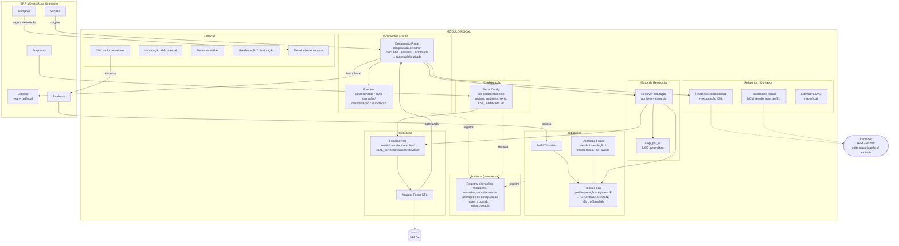

# Módulo Fiscal — Diagrama Completo

```mermaid
flowchart TB
    subgraph ERP["ERP Móveis Rosa (já existe)"]
        VENDA[Vendas]
        COMPRA[Compras]
        ESTOQUE[Estoque<br/>real + qtdfiscal]
        PRODUTO[Produtos]
        EMPRESA[Empresas]
    end

    subgraph FISCAL["MÓDULO FISCAL"]
        direction TB

        subgraph CFG["Configuração"]
            FC[Fiscal Config<br/>por estabelecimento<br/>regime, ambiente, série,<br/>CSC, certificado ref]
        end

        subgraph TRIB["Tributação"]
            PT[Perfil Tributário]
            OP[Operação Fiscal<br/>venda / devolução /<br/>transferência / NF avulsa]
            RF[Regra Fiscal<br/>perfil+operação+regime+UF<br/>→ CFOP base, CSOSN, alíq., cClassTrib]
            PT --> RF
            OP --> RF
        end

        subgraph MOTOR["Motor de Resolução"]
            RES[Resolver tributação<br/>por item + contexto]
            CFOPAUTO[cfop_por_uf<br/>5/6/7 automático]
            RES --> CFOPAUTO
        end

        subgraph DOCS["Documentos Fiscais"]
            DF[Documento Fiscal<br/>máquina de estados:<br/>rascunho→enviada→autorizada<br/>→cancelada/rejeitada]
            EV[Eventos<br/>cancelamento / carta correção /<br/>manifestação / inutilização]
            DF --> EV
        end

        subgraph ENT["Entradas"]
            XMLIN[XML de fornecedores]
            IMPXML[Importação XML manual]
            NREC[Notas recebidas]
            MANIF[Manifestação / distribuição]
            DEVC[Devolução de compra]
        end

        subgraph AUD["Auditoria (transversal)"]
            AUDIT[Registra: alterações tributárias,<br/>emissões, cancelamentos,<br/>alterações de configuração<br/>quem / quando / antes→depois]
        end

        subgraph ADP["Integração"]
            FS[FiscalService<br/>emitir/cancelar/consultar/<br/>carta_correcao/inutilizar/devolver]
            FOCUS[Adapter Focus NFe]
            FS --> FOCUS
        end

        subgraph REL["Relatórios / Contador"]
            RCONT[Relatórios contabilidade<br/>+ exportação XML]
            PEND[Pendências fiscais<br/>NCM zerado, sem perfil...]
            EST[Estimativa DAS<br/>não oficial]
        end
    end

    PRODUTO -->|aponta| PT
    EMPRESA --> FC
    VENDA -->|origem| DF
    COMPRA -->|origem devolução| DEVC
    XMLIN -->|alimenta| PRODUTO

    DF --> RES
    RES --> RF
    RES --> FS
    FC --> FS
    FOCUS --> SEFAZ[(SEFAZ)]

    FOCUS -->|autorizada| DF
    DF -->|baixa fiscal| ESTOQUE
    DF --> RCONT

    RCONT -.-> CONTADOR([Contador<br/>read + export<br/>edita classificação c/ auditoria])
    PEND -.-> CONTADOR

    %% auditoria observa os blocos sensíveis
    TRIB -.->|registra| AUDIT
    DOCS -.->|registra| AUDIT
    CFG -.->|registra| AUDIT
```
