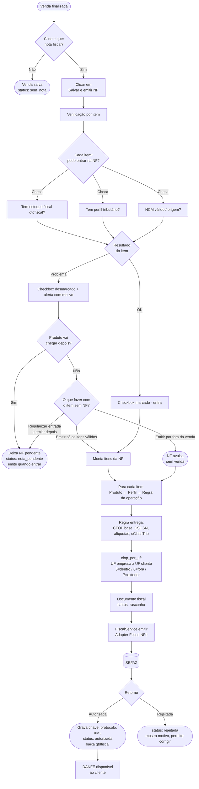

# Fluxo de Emissão de NF (venda → SEFAZ)

```mermaid
flowchart TD
    A([Venda finalizada]) --> B{Cliente quer<br/>nota fiscal?}
    B -->|Não| Z1([Venda salva<br/>status: sem_nota])
    B -->|Sim| C[Clicar em<br/>Salvar e emitir NF]

    C --> D[Verificação por item]
    D --> E{Cada item:<br/>pode entrar na NF?}

    E -->|Checa| E1[Tem estoque fiscal qtdfiscal?]
    E -->|Checa| E2[Tem perfil tributário?]
    E -->|Checa| E3[NCM válido / origem?]

    E1 & E2 & E3 --> F{Resultado<br/>do item}
    F -->|OK| G[Checkbox marcado - entra]
    F -->|Problema| H[Checkbox desmarcado + alerta com motivo]

    H --> I{Produto vai<br/>chegar depois?}
    I -->|Sim| J([Deixa NF pendente<br/>status: nota_pendente<br/>emite quando entrar])
    I -->|Não| K{O que fazer com<br/>o item sem NF?}
    K -->|Emitir só os itens válidos| L[Monta itens da NF]
    K -->|Regularizar entrada<br/>e emitir depois| J
    K -->|Emitir por fora da venda| W

    G --> L

    L --> M[Para cada item:<br/>Produto → Perfil → Regra da operação]
    M --> N[Regra entrega:<br/>CFOP base, CSOSN, alíquotas, cClassTrib]
    N --> O[cfop_por_uf:<br/>UF empresa x UF cliente<br/>5=dentro / 6=fora / 7=exterior]
    O --> P[Documento fiscal<br/>status: rascunho]

    P --> Q[FiscalService.emitir<br/>Adapter Focus NFe]
    Q --> R[(SEFAZ)]
    R --> S{Retorno}
    S -->|Autorizada| T([Grava chave, protocolo, XML<br/>status: autorizada<br/>baixa qtdfiscal])
    S -->|Rejeitada| U([status: rejeitada<br/>mostra motivo, permite corrigir])

    T --> V[DANFE disponível<br/>ao cliente]

    W([NF avulsa<br/>sem venda]) --> M
```
